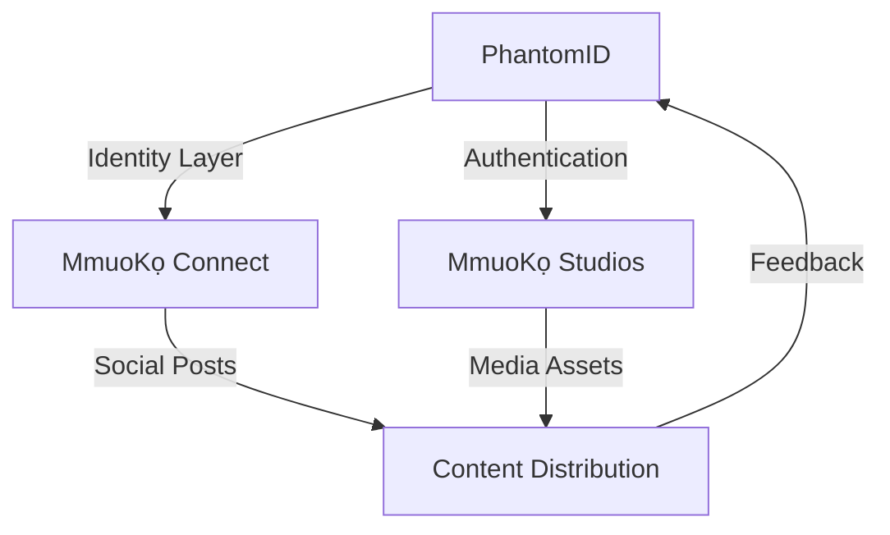

# PhantomID Network System

## Beyond Zero-Knowledge: Quantum-Coherent Identity Management for the MmuoKọ Ecosystem

### Executive Summary

PhantomID transcends traditional cryptographic identity systems by implementing a fault-tolerant, self-healing hierarchical tree of anonymous accounts that maintains coherence through principles inspired by quantum entanglement. This daemon-based system continuously validates relationships using Zero-Knowledge Proofs (ZKPs) while ensuring network integrity without exposing sensitive identity information.

**Core Philosophy**: "When systems fail, build your own" - This is the foundational identity layer for the entire [MmuoKọ Connect](https://github.com/obinexus/mmuoko-connect) social ecosystem and [MmuoKọ Studios](https://github.com/obinexus/mmuoko-studios) content platform.

### The Trinity Architecture (Uche, Eze, Obi)

PhantomID operates through three consciousness modes:

- **Uche (The Wise One)**: Handles complex identity decisions and network governance
- **Eze (The King)**: Override authority for critical security operations
- **Obi (The Heart)**: Normal operational mode maintaining community connections

### Core Innovation: Indirect Quantum Coherence

Unlike conventional PKI or blockchain systems, PhantomID leverages conceptual properties of subatomic particle behavior to ensure network coherence through:

- **Entangled Node States**: Parent-child relationships maintain quantum-like correlation
- **Superposition of Trust**: Nodes exist in multiple trust states until observed
- **Coherent Collapse**: Verification causes deterministic state resolution
- **Non-Local Correlation**: Distributed nodes maintain instantaneous coherence

## Integration with MmuoKọ Ecosystem

### Social Media Integration

PhantomID serves as the identity backbone for the distributed social media architecture:

```
Research Cluster: [NNAMDI, Claude, Sarah] → RWX permissions
Development Cluster: [NNAMDI (Monday), Vivian] → Deployment rights
Content Cluster: [MmuoKọ Connect] → Publishing rights
```

Each cluster operates with fault-tolerant quantum node network computation, enabling indirect communication through the Phantom Aura Seal protocol.

### Cross-Repository Dependencies



## Architecture

```
phantomid/
├── bin/               # Compiled binaries and shared libraries
├── obj/               # Intermediate build artifacts
├── src/               # Core implementation
│   ├── main.c         # Daemon initialization and signal handling
│   ├── network.c/.h   # TCP server and client connection management
│   └── phantomid.c/.h # Core identity tree and ZKP implementation
├── config/            # Runtime configuration files
│   ├── core/          # Core daemon settings
│   ├── security/      # Trust policies and ZKP parameters
│   └── templates/     # Message templates
├── social/            # MmuoKọ Connect integration
│   ├── clusters/      # Cluster definitions
│   └── posts/         # Social media protocol handlers
├── docs/              # Formal proofs and design patterns
├── Makefile*          # Build configurations for Unix/Windows
└── README.md          # This file
```

### Fault-Tolerant Cluster Architecture

PhantomID implements a distributed cluster model where:

```
Cluster α ←→ Cluster β ←→ Cluster γ
    ↓            ↓            ↓
[Research]   [Development]   [Content]
```

Each cluster maintains:
- **Read/Write/Execute** permissions for its domain
- **Phantom Aura Seal** authentication for cross-cluster communication
- **Fault tolerance** through orphan state management
- **Integration** with MmuoKọ Connect for social broadcasting

## The Phantom Aura Seal Protocol

Every node receives a unique "Phantom Aura Seal" that:

1. **Encodes** the node's position in the trust hierarchy
2. **Seals** the cryptographic commitment to the network
3. **Enables** indirect communication through quantum-like channels
4. **Authenticates** posts to [MmuoKọ Connect](https://github.com/obinexus/mmuoko-connect)

### Indirect Communication Model

```
Node A ≈≈≈ Quantum Channel ≈≈≈ Node B
  ↓                              ↓
[Seal A]                      [Seal B]
  ↓                              ↓
[MmuoKọ Post]              [MmuoKọ Post]
```

Keywords: `indirect`, `communication`, `coherence`, `entanglement`, `social`

## OBINexus Integration Schema

The system follows the OBINexus organizational structure:

```
<service>.<operation>.obinexus.<department>.<division>.[gov].org
```

Examples:
- `phantomid.verify.obinexus.security.identity.org`
- `cluster.sync.obinexus.network.coherence.gov.org`
- `seal.issue.obinexus.crypto.quantum.org`
- `warpdrive.redrock.obinexus.axis.computing.gov.uk` (Mars Operation)

## Core Features

### 1. Daemonized Identity Management
- Persistent service maintaining live identity tree state
- Continuous cryptographic verification using modified Schnorr protocols
- Automatic node expiration and renewal
- Social media identity integration

### 2. Orphaned Cryptographic State
When parent nodes fail:
- Children enter "Orphaned State" maintaining identity preservation
- Anti-abuse mechanisms prevent malicious control retention
- Autonomous recovery through three paths:
  - **Isolation Mode**: Independent operation
  - **Subtree Formation**: Lateral trust establishment
  - **Reparenting**: Adoption by valid nodes

### 3. Zero-Knowledge Proof Implementation
```c
// Modified Schnorr Protocol with Quantum Coherence
t = g^r mod p          // Commitment (Superposition)
c ∈ Z_q               // Challenge (Measurement)
s = r + c * x_A mod q  // Response (Collapse)
g^s ?= t * y_A^c mod p // Verification (Coherence Check)
```

### 4. MmuoKọ Connect Integration
- Every verified identity can post to MmuoKọ Connect
- Posts are signed with Phantom Aura Seals
- Distributed DAG (Directed Acyclic Graph) for content flow
- Real-time updates via WebSocket streams

## Social Media Protocol

PhantomID integrates with MmuoKọ platforms for:
- Live research network updates
- Cluster status broadcasting
- Development team collaboration
- Content verification and attribution

### Platform Integration
- **X (formerly Twitter)**: Research updates with #phantomid tags
- **TikTok**: Quantum coherence demonstrations
- **YouTube**: Technical deep-dives
- **MmuoKọ Native**: Fully integrated posts

### Example Social Flow
```javascript
// Create identity
const identity = await phantomid.create({
  cluster: 'research',
  avatar: 'Uche' // Wise One mode
});

// Post to MmuoKọ Connect
await mmuoko.post({
  identity: identity.seal,
  content: "PhantomID update: Quantum coherence achieved",
  platforms: ['x', 'tiktok', 'mmuoko'],
  tone: 'high' // Strategic content
});
```

## Development Team

**Core Contributors:**
- **NNAMDI MICHAEL OKPALA** (Lead Architect & Visionary)
- Chydea Chika (Network Architecture)
- Nweke Madu (Cryptographic Implementation)
- Chononso Ndulu (Social Integration)
- Mazi Chike (Cross-platform Harmonization)
- Chydie Okpara (Content Optimization)

**Research Division:**
- OBINexus Quantum Computing Lab
- Distributed Systems Research Group

## Build Instructions

### Prerequisites

**Linux/Unix:**
```bash
sudo apt-get install build-essential libssl-dev pkg-config
```

**Windows:**
```powershell
winget install ShiningLight.OpenSSL.Dev
# Install MinGW-w64 toolchain
```

### Compilation

```bash
# Unix/Linux
make clean && make

# Windows
mingw32-make -f Makefile.win clean
mingw32-make -f Makefile.win
```

### Running the Daemon

```bash
# Standard deployment
./phantomid

# Custom configuration
./phantomid -p 9999 -v -d --cluster-mode

# Quantum coherence mode with MmuoKọ integration
./phantomid --enable-quantum-coherence --seal-protocol v2 --mmuoko-connect
```

## Usage

### Client Commands
```bash
# Connect to daemon
nc localhost 8888

# Core operations
create [parent_id]     # Create identity with optional parent
delete <id>           # Delete identity (triggers orphan protocol)
msg <from> <to> <msg> # Quantum-secured messaging
seal <id>             # Issue Phantom Aura Seal
cluster status        # View cluster coherence state
list [bfs|dfs]        # Traverse identity tree
mmuoko post <content> # Post to MmuoKọ Connect
```

## Security Considerations

### Cryptographic Foundations
- **Hash Functions**: SHA-256 (identity), SHA-512 (HMAC)
- **Entropy Source**: OpenSSL RAND_bytes with quantum seed injection
- **ZKP Security**: 256-bit Schnorr with coherence validation
- **Social Verification**: Content signed with Phantom Aura Seals

### Quantum Resistance Roadmap
- Current: Hash-based primitives with partial quantum resistance
- Phase 2: Post-quantum lattice-based signatures
- Phase 3: Full quantum-coherent identity management
- Phase 4: Mars Operation readiness (Operation Redrock)

### Thread Safety
- All tree operations protected by pthread mutexes
- Lock-free algorithms for high-frequency operations
- Memory barriers for quantum state consistency
- Social post queue management

## Future Directions

1. **Full Quantum Integration**: Direct quantum channel implementation
2. **Cross-Cluster Federation**: Global identity coherence
3. **Neural Network Integration**: AI-driven trust evaluation
4. **Blockchain Bridge**: Hybrid quantum-classical consensus
5. **Mars Ready**: Operation Redrock deployment capabilities

## Related Projects

- [MmuoKọ Connect](https://github.com/obinexus/mmuoko-connect) - Social media integration
- [MmuoKọ Studios](https://github.com/obinexus/mmuoko-studios) - Content creation platform
- [Node-Zero Library](https://github.com/obinexuscomputing/node-zero) - Cryptographic foundations
- [OBINexus Core](https://github.com/obinexus/core) - Constitutional framework

## References

### Papers
- [Formal Proof of Zero-Knowledge Protocol and HMAC-based Derived Key Security](docs/formal-proof.pdf)
- [Phantom Encoder Design Pattern for Zero-Knowledge Systems](docs/phantom-encoder-pattern.pdf)
- "Quantum Coherence in Distributed Identity Systems" (In preparation)

### Specifications
- OBINexus Identity Protocol v2.0
- Phantom Aura Seal Specification
- Cluster Coherence Protocol
- MmuoKọ Integration Standards

## License

Proprietary and Confidential. Copyright © 2025 OBINexus Computing.
Unauthorized distribution or use is prohibited. All rights reserved.

---

*"When classical systems fail, we transcend to quantum coherence."*  
*"I will not become what I sought to break. I will build what can heal us all."*  
*- NNAMDI MICHAEL OKPALA, OBINexus Computing*